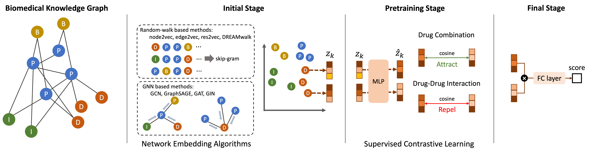
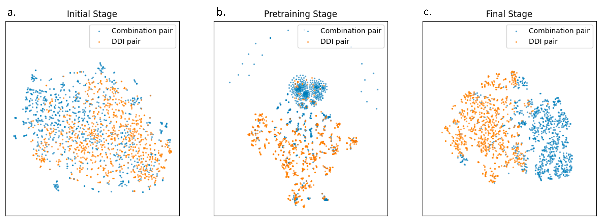

# DC_with_DDI_SupCon
The official code implementation for DC_with_DDI_SupCon from the paper [Drug Combination prediction with Drug-Drug Interaction data as negative data and Supervised Contrastive Learning as pretraining technique (preprint)]

## Model description
The overall framework of our work is shown below.



## Setup
Step 1. Clone this repository and move to the directory.
```
git clone https://github.com/gujh14/DC_with_DDI_SupCon.git
```
Step 2. Install necessary packages.
```
pip install -r requirements.txt
```
Step 3. (If you want to use wandb for logging) Register your wandb profile on your local machine.

## Prepare data
To preprocess and split data, run ```preprocess.ipynb``` and ```data_split_gcn.ipynb```.

## Training
To train new model, run bash scripts (```script_rw.sh``` and ```script_gnn.sh```).

You need to adjust the arguments as you wish.

(If using wandb), use your own wandb entity & project name for arguments.

## Embedding space visualization
To visualize the embedding vectors of drug pairs, run ```visualization_embedding_space.ipynb```.



## Case study
To perform case studies, run ```case_study.ipynb```.